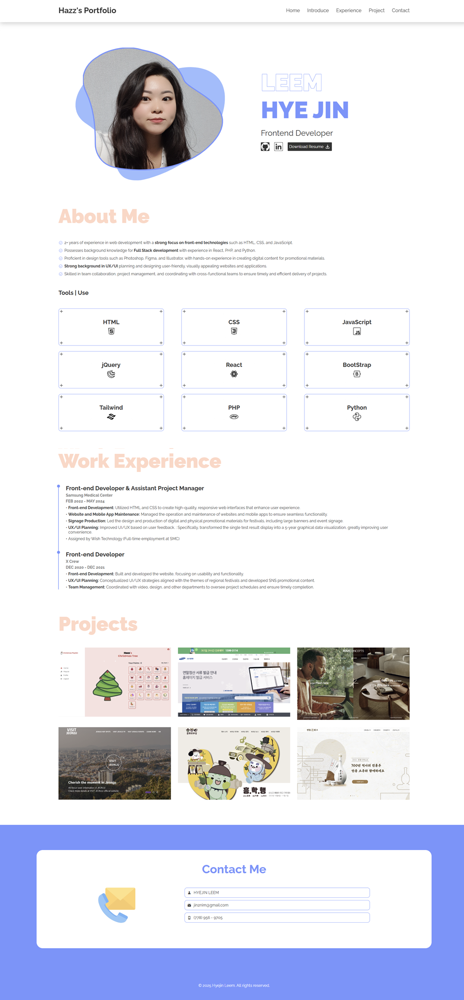

# Hazz Portfolio

### Click Demo

https://jin2nim.github.io/

## Project Overview

This page features my personal projects, work from previous employers, and a personal introduction. It was created using HTML, CSS, and JavaScript.

## Features

1. **Introduction**: Includes a personal introduction detailing my passion for front-end development and the technologies and tools I use.
2. **Portfolio**: Showcases work from previous employment and personal projects, with links to detailed source code and previews upon clicking.
3. **Contact Form**: Provides a form to easily contact me directly.

## Technologies and Tools

HTML, CSS, JavaScript, React

## Contact Me

- **Email** : jin2nim@gmail.com
- **LinkedIn**: [linkedin.com/in/jin2nim](https://www.linkedin.com/in/jin2nim)
- **GitHub**: [github.com/jin2nim](https://github.com/jin2nim)
